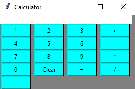

# Simple Calculator

This Python program implements a simple calculator using the Tkinter library. It allows users to perform basic arithmetic operations such as addition, subtraction, multiplication, and division.



## Table of Contents

- [Features](#features)
- [Usage](#usage)
- [Configuration](#configuration)
- [Contributing](#contributing)
- [License](#license)

## Features

- Addition (+), subtraction (-), multiplication (*), and division (/) operations.
- Decimal point (.) support for floating-point numbers.
- Input validation to handle invalid expressions.
- Keyboard support for input (numeric keys, arithmetic operators, Enter for result, Backspace for clearing).

## Usage

1. **Run the Program**: Execute the Python script to start the calculator:
    ```
    python Calculator with GUI.py
    ```

2. **Input Expression**: Use the graphical buttons to input the expression you want to evaluate. You can also use the keyboard for input.
   - Numeric keys: Enter digits (0-9).
   - Arithmetic operators: +, -, *, /
   - Enter key (Return): Calculate the result.
   - Backspace key: Clear the current expression.

3. **View Result**: The program will display the result of the evaluated expression in the text entry box.


## Contributing
Contributions are welcome! If you'd like to contribute to this project, please follow these steps:

1. Fork this repository.
2. Create a branch:
```bash
git checkout -b feature/new-feature
```
3. Commit your changes:
```bash
git commit -m 'Add some feature'
```
4. Push to the branch:
```bash
git push origin feature/new-feature
```
5. Create a pull request.

## License
This project is licensed under the MIT License.
